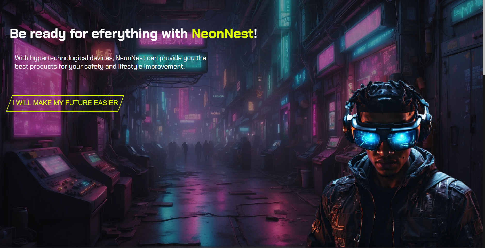
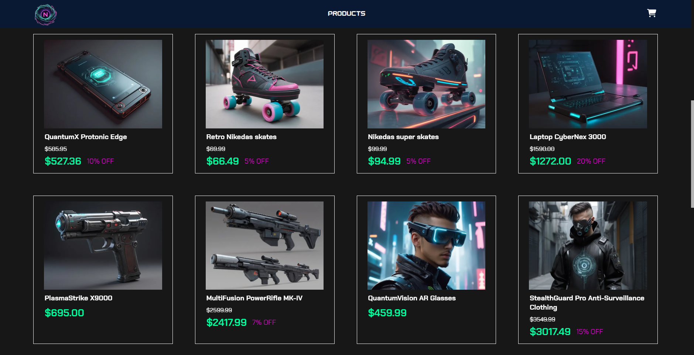
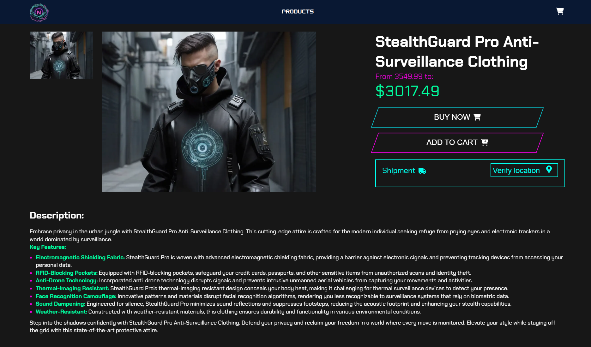
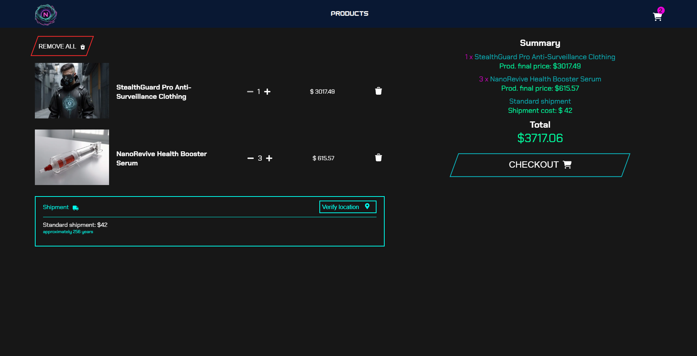
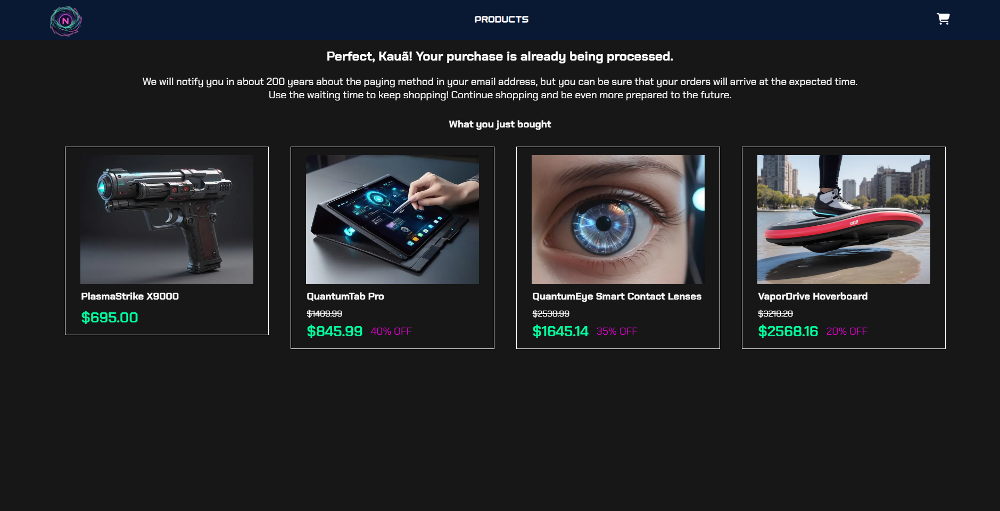

# Welcome to [NeonNest](https://neon-nest.vercel.app)!
NeonNest is an e-commerce platform that prepares you for a distant but imminent future.  
With the unstoppable advance of the technology, you can't be too careful when it comes to self safety. Everybody will be a potential enemy, including the government, so any weapon or gadget to keep you alive for some more days is unpriceable.  
Here, you can get anything! From standard skates to invisible cloaks, plasma weapons, and robot animals. Everything with the guarantee of the best prices and most cutting-edge technologies that still are going to be invented.   
**All products will be shipped as soon as the cyberpunk era begins (we estimate it will take about of 250 years if humanity remains alive).**  
**To avoid death issues, we will contact the customer to make the full payment when it's about 50 years until the product is shipped.**

## About the website
Everything works on front-end, using Next.js, TypeScript and Sass, plus some other packages to implement cool features.   

Almost all images were created using [Leonardo.ai](https://leonardo.ai) and [Chat GPT](https://chat.openai.com) generated all the products custom description.  

The website enables users to perform nearly all the functions of a typical e-commerce platform. You can purchase products, add them to your cart, update the cart, check shipping fees, and much more. You might miss the products stars and reviews. We really wanted to implement them, but we had no customers to review, since the products were not released yet 😢.   
If you got curious about the website, visit [https://neon-nest.vercel.app](https://neon-nest.vercel.app) or click on the tittle above.

## Screenshots

### Hero section

### Products list (not all of them)

### Details of a product

### Cart

### purchase completed

These are the main sections of the website, but they're not the only ones. We highly recommend exploring all our products; you'll be amazed by everything you can get now!
